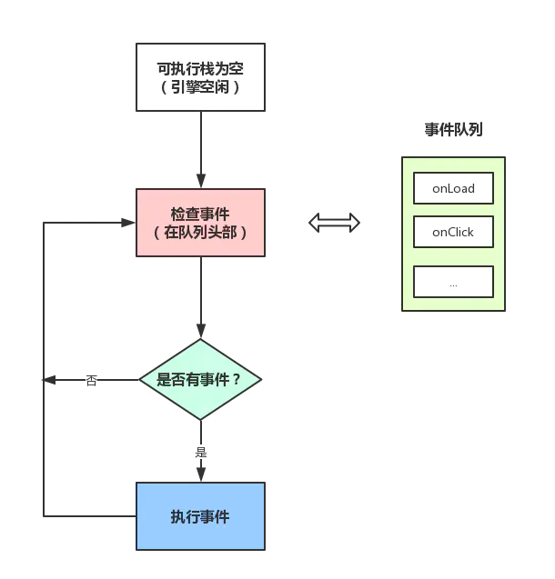
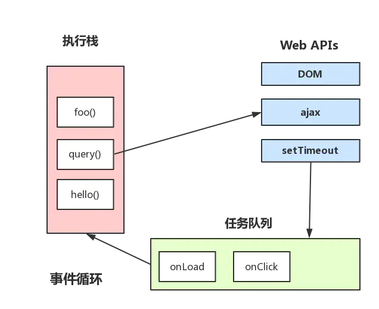
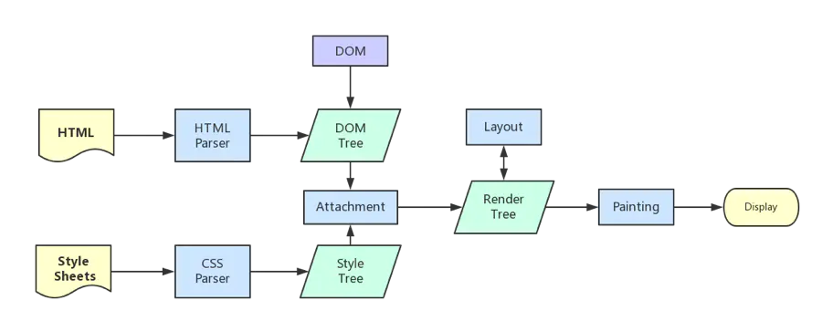

## 从EventLoop谈JS的运行机制
+ JS分为同步任务和异步任务
+ 同步任务在主线程上执行，形成一个执行栈
+ 主线程之外，**事件触发线程**管理着一个任务队列，只要异步任务有了结果，就在任务队列里放置一个事件
+ 一旦执行栈中所有的同步任务执行完毕（JS引擎空闲）,就会读取任务队列，将可运行的异步任务添加到可执行栈中，开始执行

***

上图的大致描述就是：
+ 主线程运行时会产生执行栈，栈中的代码调用某些api时，会在事件队列中添加各种事件
+ 当栈中的代码执行完毕，就会读取事件队列中的事件，去执行那些回调
+ 一直循环
+ **总要等到栈中的代码执行完毕后才会去读取事件队列中的事件**
***
## macrotask 与 microtask 
+ macrotask（又称宏任务），可以理解是每次执行栈执行的代码就是一个宏任务（包括每次从事件队列中获取一个事件回调并放在执行栈中执行）
+   每个task会从头到尾将这个任务执行完毕，不会执行其它

## 浏览器渲染进程
浏览器渲染进程是多线程的，下面列举包含了哪些线程
### 1. GUI渲染线程
+ 负责渲染浏览器界面，解析HTML、CSS、构建DOM树和Render树，布局和绘制等
+ 当界面需要重绘(Repanint)或由于某种操作引发回流(reflow)时，该线程就会执行
+ *GUI渲染线程与JS引擎线程是互斥的，当JS引擎执行时GUI线程会被挂起（相当于被冻结了）,GUI更新会被保存在一个队列中等到JS引擎空闲时立即被执行*
### 2. JS引擎线程
+ 负责解析JavaScript脚本，运行代码（例如V8引擎）
+ JS引擎一直等待着任务队列中任务的到来，然后加以处理，一个Tab页(Render进程)中无论什么时候都只有一个JS线程在运行
+ 由于GUI渲染线程与JS引擎线程时互斥的，所以所过JS执行的事件过长，就会造成页面的渲染不连贯，导致页面渲染加载阻塞
### 3. 事件触发线程
+ *归属于浏览器而不是JS引擎，用来控制事件循环*，（JS引擎自己忙不过来，需要浏览器另开线程协助）
+ 当JS引擎执行代码块如setTimeout时(也可来自浏览器内核的其它线程、如鼠标点击事件、AJAX异步请求等)，会将对应的任务添加到事件线程中
+ 当对应的事件符合触发条件被触发时，该线程会把事件添加到待处理队列的队尾，等待JS引擎的处理
+ 由于JS单线程的原因，所以这些待处理队列中的事件都得排队等待JS引擎处理（当JS引擎空闲时才会去执行）
### 4. 定时器触发器线程
+ 传说中setInterval和setTimeout所在的线程
+ 浏览器定时计数器并不是由JS引擎计数的（因为JS引擎是单线程的，如果处于阻塞线程状态就会影响计时的准确性）
+ 因此单独线程来计时并触发定时（计时完毕后，添加到事件队列中，等待JS引擎空闲后执行）
+ *W3C在HTML标准中规定，规定要求setTimeout中低于4ms的时间间隔算作4ms*
### 5. 异步http请求线程
+ 在XMLHttpRequest在连接后是通过浏览器新开一个线程请求
+ 检测到状态变更时，如果设置有回调函数，异步线程就产生状态变更事件，将这个回调函数放入事件队列中，等待JS引擎执行

***
## JS引擎为什么是单线程
JavaScript的单线程，与它的用途有关。作为浏览器脚本语言，JavaScript的主要作用是与用户交互，以及操作DOM。这中特性决定了它只能是单线程，否则会带来很负责的同步问题。比如，假定JavaScript同时有两个线程，一个线程在某个节点添加内容，另一个线程删除这个节点，这是浏览器不知道以哪个线程为准。

为了利用多核CPU的计算能力，HTML5提出Web Worker标准，允许JavaScript脚本创建多个线程，但是子线程完全受主线程控制，且不得操作DOM。所以，这个新标准并没有改变JavaScript单线程的本质。
***
## GUI渲染线程与JS引擎线程互斥
由于JavaScript是可以操作DOM的，如果在修改这些元素属性的同时渲染界面（即JS线程与GUI线程同时运行），那么渲染线程前后获得的元素数据就可能不一致了。

因此，为了防止渲染出现不可预期的结果，浏览器设置GUI渲染线程与JS线程为互斥的关系，当JS线程执行时GUI线程会被挂起，GUI更新会被保存在一个队列中等到JS线程空闲时立即执行。
***
## JS阻塞页面加载
由上述互斥关系，可以推导出，JS如果执行时间过长就会阻塞页面。

譬如，假设JS引擎正在进行巨量的计算，此时就算GUI有更新，也会被保存到队列中，等待JS引擎空闲后执行。 然后，由于巨量计算，所以JS引擎很可能很久很久后才能空闲，自然会感觉到巨卡无比。

所以，要尽量避免JS执行时间过长，这样就会造成页面的渲染不连贯，导致页面渲染加载阻塞的感觉。
***
## 浏览器渲染流程
1. 解析html建立dom树
2. 解析css构建css样式树(然后结合dom树合并成render树)
3. 布局render树（Layout/reflow）,负责各元素尺寸、位置的计算
4. 绘制render树（paint），绘制页面像素信息
5. 浏览器会将各层的信息发送给GPU,GPU会将各层合成（composite），显示在屏幕上

***
## load事件与DOMContentLoaded事件
+ 当DOMContentLoaded事件触发时，仅当DOM加载完成，不包括CSS、图片等资源
+ 当onload事件触发时，页面上所有的DOM、样式表、脚本、图片都已经加载完成

所以，DOMContentLoaded先于load
***